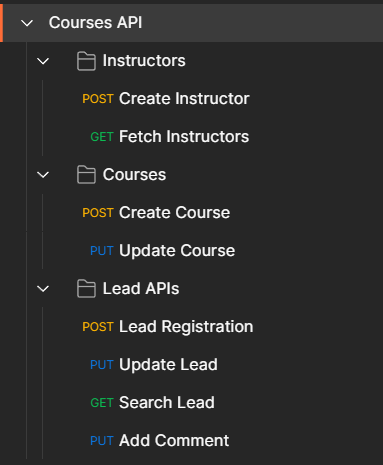
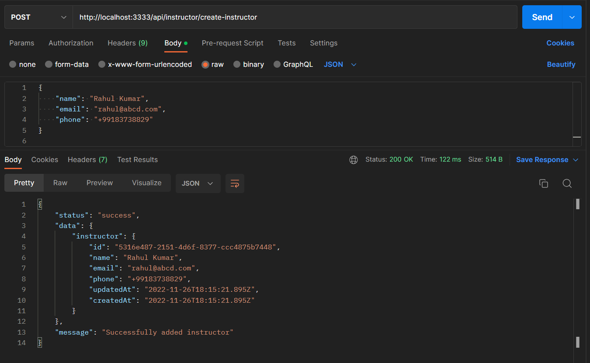
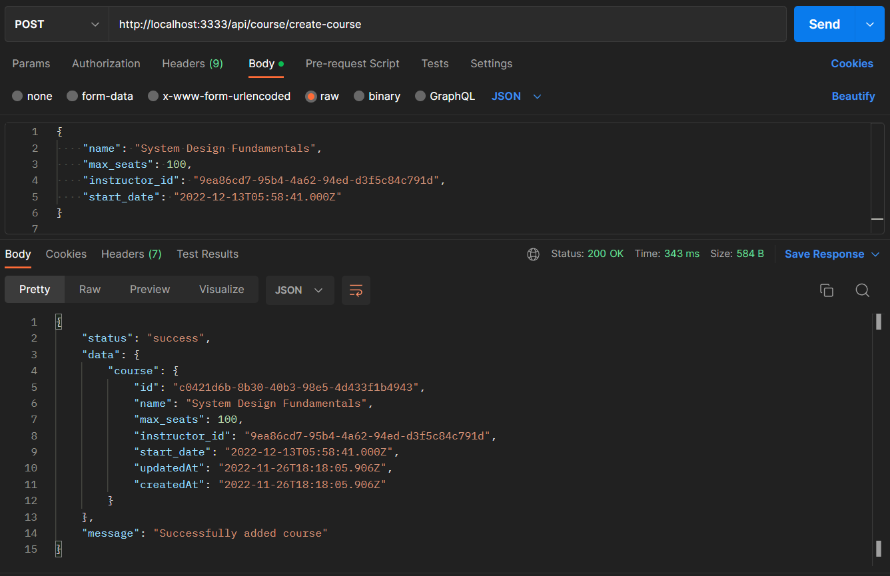
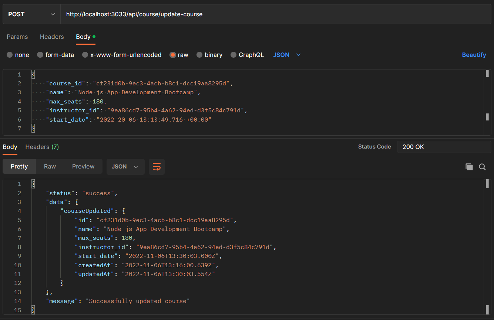
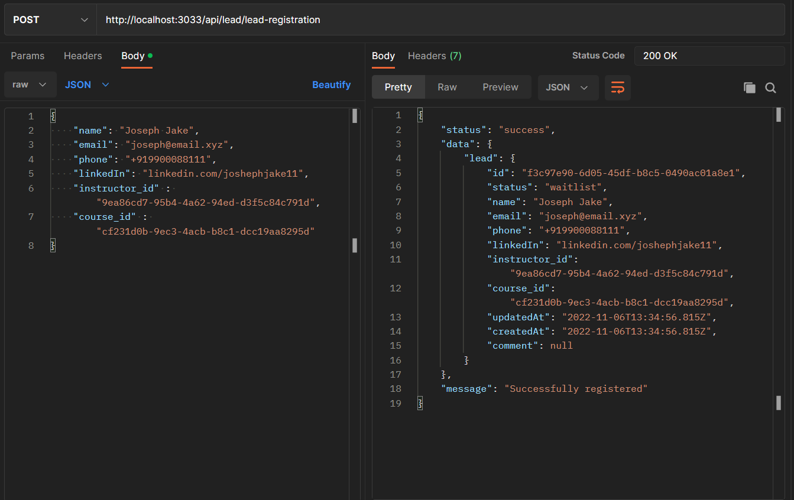
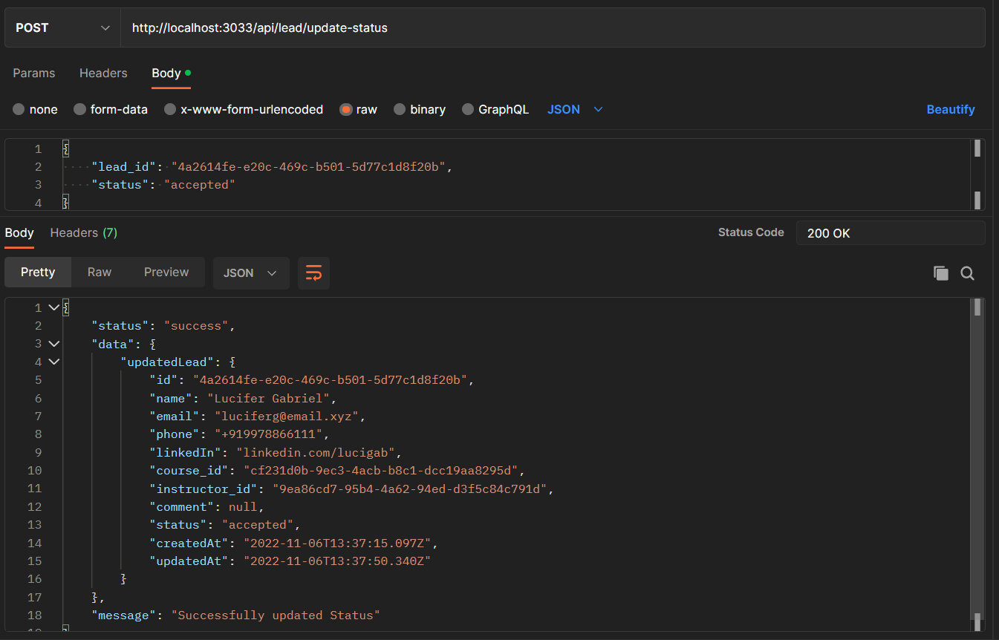
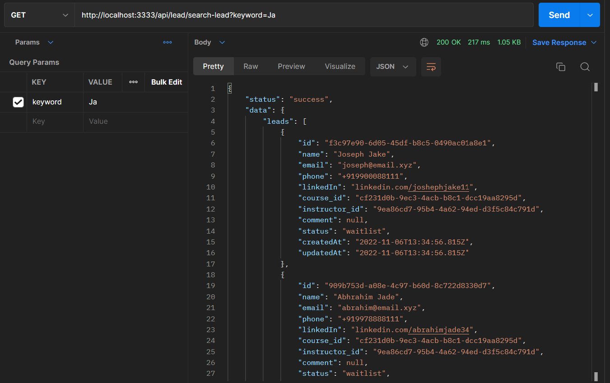

# Airtribe Courses API

|  |
| ---------------------------------------------- | 

## POSTMAN RECORDS FOR THE APIs

### RESTful API list
|  | 
| ---------------------------------------------- | 

### Create Instructor API
|  | 
| ---------------------------------------------- | 

### Add Course API
|  | 
| ---------------------------------------------- | 

### Update Course details API
|  | 
| ---------------------------------------------- | 

### Lead Registration/Enrollment API
|  | 
| ---------------------------------------------- | 

### Update Lead Status API
|  | 
| ---------------------------------------------- | 

### Search for Lead via name or email
|  | 
| ---------------------------------------------- | 

### Add comment for Lead API
|  | 
| ---------------------------------------------- | 
